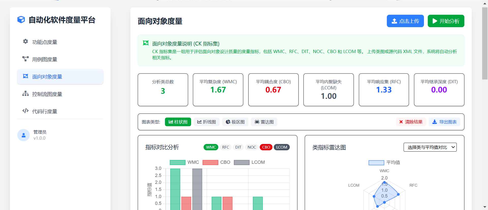
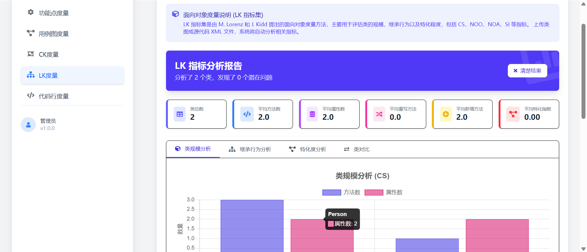
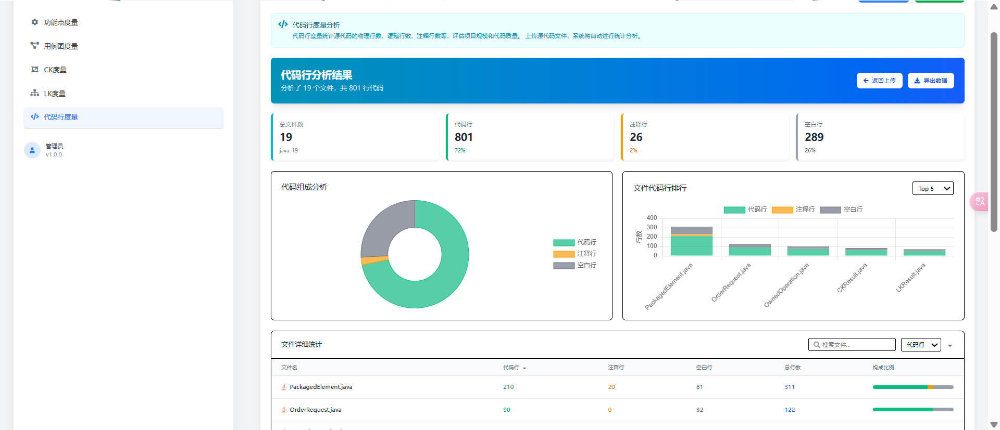

# 自动化软件度量平台

一个基于 Vue 3 和 tailwindcss 构建的自动化软件度量平台，支持功能点、用例图、面向对象和代码行等多种软件度量分析。平台提供直观的图表展示和质量评估，帮助开发者快速了解代码质量和复杂度。

## 功能特性
- [x] **功能点度量**：计算功能点数👌
- [x] **用例点度量**：评估系统复杂度和工作量👌
- [x] **CK度量**：支持 CK 指标集分析（WMC、RFC、DIT 等）🤗
- [x] **LK度量**：支持 LK 指标集分析（包括 CS、NOO、NOA、SI 等）👊
- [x] **代码行度量**：统计代码行数、注释行数等👋

## 技术栈
- Vue 3 + Vite
- Tailwind CSS
- Chart.js
- Axios

### 示例图:

    
    
<em>功能点度量</em>

 

    
    
<em>用例点度量</em>

 

    
    
<em>CK度量界面示例</em>

 

    
    
<em>LK度量界面示例</em>

 

    
    
<em>代码行度量界面</em>

